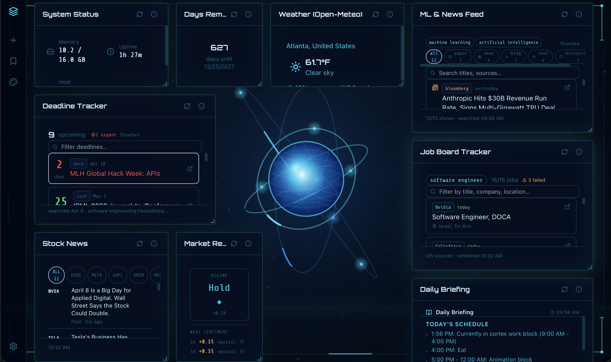

# Fwubbo



Personal AI-powered daily dashboard for macOS. Describe a widget in plain English — Claude generates the data fetcher and React component and it appears live on your dashboard.

Built with Tauri 2, React, Vite, Tailwind, and FastAPI.

![Themes: Frutiger Aero, JARVIS, Windows XP, Matrix Terminal, Paper & Ink]

---

## Download

Grab the latest `.dmg` from [Releases](../../releases) and drag Fwubbo to your Applications folder.

You still need to set up the Python backend (see below) — the `.app` launches it automatically once configured.

---

## Setup

### 1. Install frontend dependencies

```bash
npm install
```

### 2. Set up the Python backend

```bash
cd backend
python -m venv venv
source venv/bin/activate
pip install -r requirements.txt
```

### 3. Add your Anthropic API key

```bash
cp backend/.env.example backend/.env
```

Edit `backend/.env` and paste your key:

```
ANTHROPIC_API_KEY=sk-ant-...
```

Get a key at [console.anthropic.com](https://console.anthropic.com).

### 4. Run

**Desktop app (Tauri):**
```bash
npm run tauri:dev
```

**Browser only (no Tauri):**
```bash
# Terminal 1
cd backend && source venv/bin/activate && uvicorn main:app --reload --port 9120

# Terminal 2
npm run dev
```
Open [http://localhost:1420](http://localhost:1420)

---

## Building a release

```bash
npm run tauri:build
```

Output: `src-tauri/target/release/bundle/dmg/Fwubbo_0.1.0_aarch64.dmg`

---

## Creating widgets

1. Click **Chat** in the sidebar
2. Describe what you want — e.g. *"Show me the weather in Atlanta"* or *"Track my top 5 stocks with daily change"*
3. Alternatively, use Claude Code. It tends to be better for more sophisticated widgets and for debugging.
4. The widget is generated and appears on your dashboard
5. Right-click any widget to configure settings, refresh, or delete

If a widget needs an API key (e.g. NewsAPI, FRED), add it via **Settings → API Keys**. Keys are stored in `backend/.env` as `FWUBBO_SECRET_<NAME>` and injected into the widget's fetch script at runtime.

---

## Themes

Four built-in themes, switchable from the sidebar:

| Theme | Vibe |
|---|---|
| Deep Ocean | Bioluminescent particles, glassmorphic cards |
| Aurora | Shifting gradient blobs, frosted glass |
| Brutalist Terminal | CRT scanlines, monospace, green-on-black |
| Paper & Ink | Warm editorial, serif fonts, minimal borders |

You can also generate custom themes via the theme chat.

---

## Architecture

Every widget is a **module** — a four-file bundle in `backend/modules/<id>/`:

| File | Purpose |
|---|---|
| `manifest.json` | ID, name, refresh interval, required secrets, settings schema, widget sizing |
| `fetch.py` | Subprocess-isolated Python script; prints one JSON object `{"status": "ok", "data": {...}}` |
| `widget.tsx` | React component compiled in-browser by Sucrase; imports only `react`, `lucide-react`, `recharts` |
| `config.json` | Per-instance user settings (gitignored) |

`fetch.py` runs in a sandbox: imports are AST-scanned against an allowlist, the environment is stripped to only necessary vars, and execution times out at 30s.

```
fwubbo/
├── src/                        # React + Vite frontend
│   ├── components/
│   │   ├── DynamicWidget.tsx   # In-browser Sucrase TSX compiler
│   │   ├── ChatPanel.tsx       # Streaming chat UI
│   │   ├── WidgetCard.tsx      # Glass card + error boundary
│   │   └── WidgetGrid.tsx      # Draggable react-grid-layout
│   ├── stores/dashboard.ts     # Zustand — layouts, modules, themes
│   ├── tauri/bridge.ts         # Safe wrappers for all Tauri APIs
│   └── themes/                 # Theme definitions + CSS variable injection
│
├── backend/
│   ├── core/
│   │   ├── sandbox.py          # AST scanner + subprocess executor
│   │   ├── module_registry.py  # Module discovery + manifest validation
│   │   └── stats_db.py         # SQLite usage tracking
│   ├── routes/
│   │   ├── chat.py             # SSE streaming chat + module write
│   │   ├── modules.py          # Fetch, state, stats endpoints
│   │   ├── secrets.py          # API key CRUD → backend/.env
│   │   └── settings.py         # Notifications, profile settings
│   └── modules/                # Generated modules (fetch.py + widget.tsx committed, config.json gitignored)
│
└── src-tauri/                  # Tauri shell — tray, autostart, backend process management
```

---

## Notes

- Widgets only have access to what their `manifest.json` declares — no arbitrary network calls or imports
- `config.json` and `state.json` in each module are gitignored (contain personal settings and cached data)
- The app hides to the system tray on close; use the tray icon or **Settings → Open at Login** to manage startup behavior
- When running the built `.app`, the backend is launched automatically from the baked-in path set at compile time
